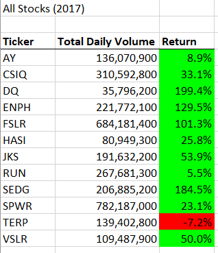
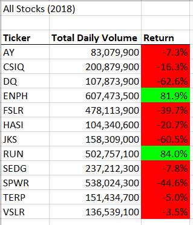

# VBA of Wall Street

## Overview of Project

### Purpose

- The purpose of this project is to analyse the stock trends of 12 different green energy companies to see which one(s) the inverstor should invest in. This project in particular focuses on refactoring the Module 2 Solution Code given in the module in order to make the original code run faster.

## Results

### Analysis of Stocks Based on Daily Toal Volumes

- According to investopedia.com, the daily total volume is how many shares are traded per day. If a stock has high volume, that means there is more demand for that stock, which often indicates that the company is doing well financially. According to the table generated for 2017, there are two companies with daily total volumes over 500,000,000. SPWR has the highest total daily volume (782,187,000), followed by FSLR, with the daily volume of 684,181,400. The company with the lowest daily volume is DQ (35,796,200), followed by HASI, with the total daily volume of 80,949,300. In 2018, ENPH has the highest daily volume (607,473,500), and AY becomes the company with the lowest (83,079,900). It is also important to look at which companies' daily total volume increased or decreased from 2017 to 2018. There are five companies whose daily total volumes have decreased from 2017 to 2018: AY, CSIQ, FSLR, JKS, and SPWR. The rest have increased. Amongst those whose daily total volume increased, ENPH's daily totaly volume increased the most; it went up by 385,701,400. According to investopedia.com, if trading voluume increases, price usually increases, and an increase in daily volume suggests that the price of the stock has beren consistently going up, which is a good sign for potential investors of the company. In conclusion, based on daily total volume, ENPH is the best choice among the 12 companies for investors both because of the highest total daily volume in 2018 and the highest volume increase from 2017 to 2018. 

### Analysis of Stocks Based on Returns

- According to investopedia.com, "a return is the change in price of an asset, investment, or project over time." If the return percentage is positive, that means the company has been making more profit over time, whereas if the percentage is negative, that means the company has been making less money. In 2017, 11 companies's returns are positive. Only TERP has a negative return percentage (-7.2%). However, in 2018, only two companies have positive return precentages. The highest return percentage is RUN at 84.0%, followed by ENPH at 81.9%. In 2017, there are four companies with return percentages over 100%, with the highest return percentage of 199.4% at DQ. When looking at the trend from 2017 to 2018 looking at all 12 companies, in 2017 the return percentage is higher, with the average of 67.32% rounded to the nearest hundredth, compared to 2018, with the average of -8.5%. This could mean that the field of green energy companies have not been doing well in general in 2018, or it could mean that the economy has not been doing well and people are spending less money. Either way, RUN and ENPH were able to still increase their price in 2018, making these two companies ideal for investments. 

### Analysis of Run Time

- The original code ran for 0.78125 seconds, whereas the refactored code only ran for 0.1015625 seconds. The refactored code runs 0.6796875 seconds faster the the original. In the oringinal code, when looping through all the rows, there are three if conditionals performed, and two of them have to have two conditions met (if (A & B) instead of just if(A)), whereas in the new code only two conditionals were necessary, and each "if" only has to have one condition met. When there are less conditions that need to be checked, the code runs faster. 

[VBA_Challenge.vbs](VBA_Challenge.vbs)

[VBA_Challenge.xlsx](VBA_Challenge.xlsx)

## Summary

- What are the advantages or disadvantages of refactoring code?
    - One of the advantages of refactoring code is helping the code run faster. There are usally a couple different ways to write code that acheieve the same result, and refactoring can help developers pick the faster version of the code that achieves the same outcomes with the original code.
    - Another advantage of refactoring is that it helps make the code easier to understand and interpret. When developers write the code for the first time, their thoughts might be tangled, and their code might be more complicated than it has to be. Refactoring makes it easier to spot those unessasary complications and helps developers reorganise their code to be more concise.
    - One of the disadvantages of refactoring code is the extra time cost to refactor. If the deadline is coming up and the refacor is not going smoothly, developers might waste time on refactoring and eventually have to go back to the original version.
    - The other disadvantage is the extra money cost to refactor. Developers might run out of money if the project has a tight budget and they need to pay employees because they spend extra time on refactoring the code. 
- How do these pros and cons apply to refactoring the original VBA script?
    - The refacoring of the original VBA script shows a couple different advantages of refactoring. In the table generated with the original VBA script, the returns are not colour coded, whereas the new code is colour coded with positive returns in green and negative returns in red, making it very clear at first glance. 
    - The refactored code runs faster than the original code. 
    - The creation of the three arrays makes it easier to understand and follow the logic of the code. 

